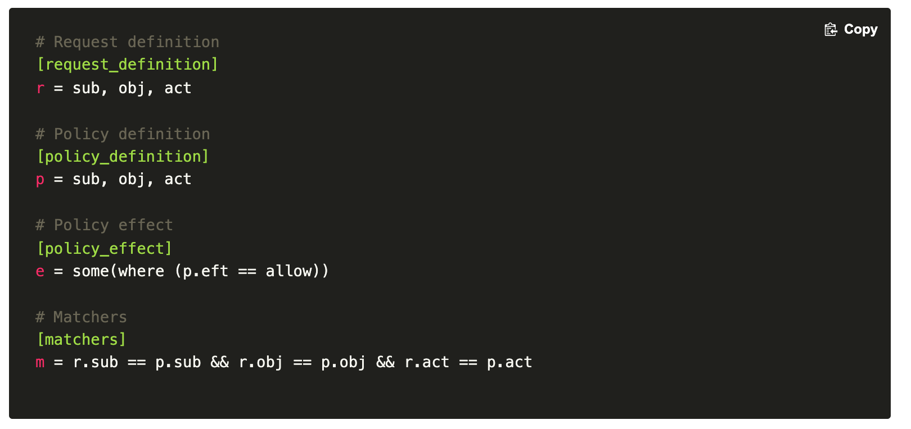
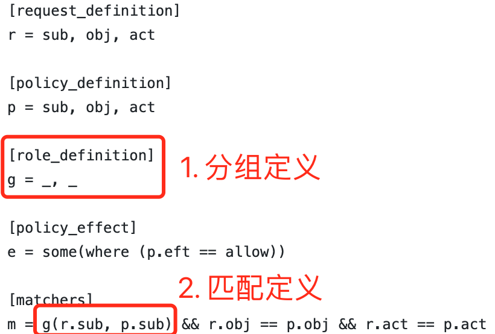
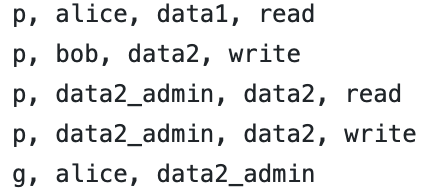
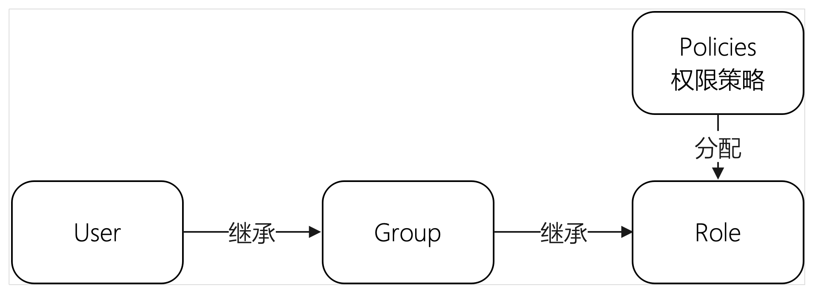
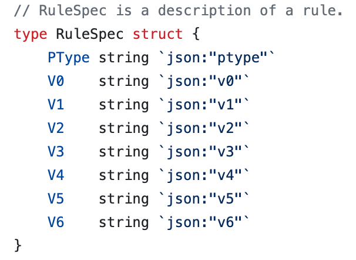
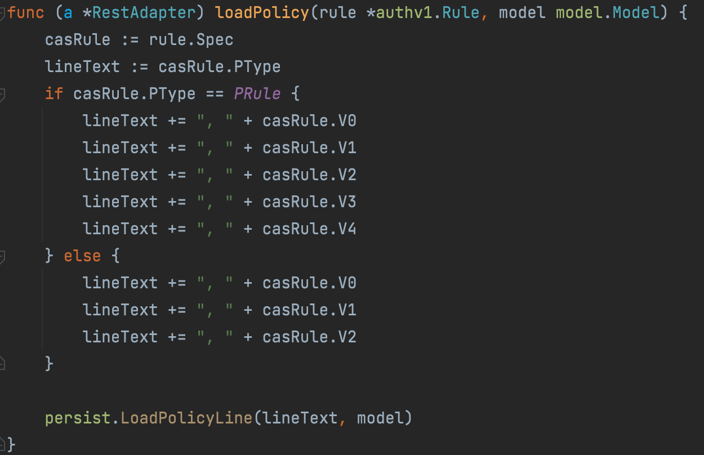
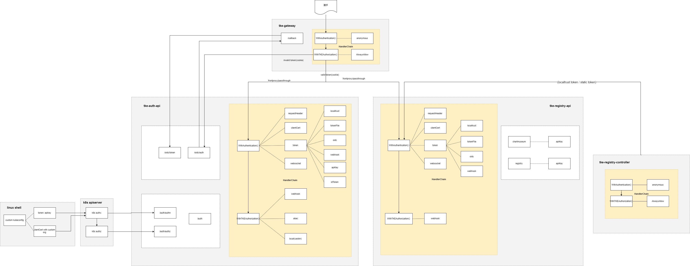

# 名词解释

- Tenant
   - 租户，类似于公有云主账号
   - TkeStack提供了多租户隔离的能力 
- Platform
   - 平台级，即拥有全局的作用范围
- Project
   - 项目级，将资源、操作限定到某个项目维度下
- User
   - 用户，定义一个成员的最基础的认证信息
   - 例如小明、小李是两个用户
   - 用户属于某个租户
   - 用户是平台级资源
   - [CRD](https://github.com/tkestack/tke/blob/master/api/auth/types.go#L201)
- Group
   - 用户组，将一组用户关联到一个分组
   - 例如小明和小李都是容器组的同事
   - 用户组属于某个租户
   - 用户组是平台级资源
   - [CRD](https://github.com/tkestack/tke/blob/master/api/auth/types.go#L240)
- Role
   - 角色，一个中间态概念，关联了一组权限策略（Policy），并分配到用户、用户组上
   - 例如小明是**研发**角色，小李是**产品**角色
   - 角色可以是平台级（Platform），也可以是项目级（Project）
      - 若将一个平台级的角色绑定到某个用户、用户组上，则用户、用户组具备了该角色所绑定了权限策略的平台级权限
      - 若将一个项目级的角色绑定到某个用户、用户组上，则用户、用户组具备了该角色所绑定了权限策略的项目级权限
   - 角色属于某个租户
   - [CRD](https://github.com/tkestack/tke/blob/master/api/auth/types.go#L744)
- Policy
   - 权限策略，[定义了Resouces、Actions、Effect三元组](https://github.com/tkestack/tke/blob/master/docs/guide/zh-CN/FAQ/Authority/%E5%A6%82%E4%BD%95%E8%AE%BE%E7%BD%AE%E8%87%AA%E5%AE%9A%E4%B9%89%E7%AD%96%E7%95%A5.md)
   - 权限策略可以是平台级（Platform），也可以是项目级（Project）
      - 通过**(un)binding**将用户、用户组与**平台级Policy**绑定，这样用户、用户组具备了平台级的操作权限
      - 通过**project(un)Binding**将用户、用户组与**项目级Policy**绑定，这样用户、用户组只在该项目下具备权限
      - 若用户、用户组是通过Role关联了某些Policy，则权限的作用范围由Role的作用域决定
   - [CRD](https://github.com/tkestack/tke/blob/master/api/auth/types.go#L490)
   
# [Casbin基础](https://casbin.org/docs/zh-CN/overview)
Casbin 可以：
   - 支持自定义请求的格式，默认的请求格式为{subject, object, action}。
   - 具有访问控制模型model和策略policy两个核心概念。
   - 支持RBAC中的多层角色继承，不止主体可以有角色，资源也可以具有角色。
   - 支持内置的超级用户 例如：root 或 administrator。超级用户可以执行任何操作而无需显式的权限声明。
   - 支持多种内置的操作符，如 keyMatch，方便对路径式的资源进行管理，如 /foo/bar 可以映射到 /foo*

Casbin 不能：
   - 身份认证 authentication（即验证用户的用户名和密码），Casbin 只负责访问控制。应该有其他专门的组件负责身份认证，然后由 Casbin 进行访问控制，二者是相互配合的关系。
   - 管理用户列表或角色列表。 Casbin 认为由项目自身来管理用户、角色列表更为合适， 用户通常有他们的密码，但是 Casbin 的设计思想并不是把它作为一个存储密码的容器。 而是存储RBAC方案中用户和角色之间的映射关系。

## [PERM](https://casbin.org/docs/zh-CN/how-it-works)
在 Casbin 中, 访问控制模型被抽象为基于 **PERM (Policy, Effect, Request, Matcher) **的一个文件。 PERM模式由四个基础（政策、效果、请求、匹配）组成，描述了资源与用户之间的关系。

Casbin需要两份文件：
- 模型文件，定义了PERM，描述了权限控制模型的Schema
   - [https://casbin.org/docs/zh-CN/syntax-for-models](https://casbin.org/docs/zh-CN/syntax-for-models)
   - 
   - r，描述了请求的schema
      - sub，主体对象，即请求发起方是谁
      - obj，资源对象，即被操作的资源是什么
      - act，动作，即触发什么类型的操作（CRUD）
   - p，定义了策略文件的格式
   - m，匹配器，定义了请求与策略的匹配规则，即策略文件中的哪些策略能够被命中
   - e，效果器，通过被命中的策略，计算出最终的准入结果（Allow还是Deny）
- 策略文件，根据模型文件中的p，填充用户自定义的授权规则
   - 
   - alice可以读取data1
   - bob可以编写data2

## [RBAC](https://casbin.org/docs/zh-CN/rbac)
- 模型定义
   - 
   - 分组定义，描述了**用户与角色（分组）之间的关系**
   - 匹配定义，g(r.sub, p.sub)描述了，**请求的主体与策略里的主体，需要在同一个角色（分组）里**
- 策略文件
   - 
   - alice对data1资源有read权限
   - data2_admin角色对data2资源有read、write权限
   - alice属于data2_admin角色（分组），因此alice也具备了data2资源的read、write权限
   - bob只有data2资源的write权限

## [域内RBAC](https://casbin.org/docs/zh-CN/rbac-with-domains)
- 模型定义
   - 
   - 域内角色定义，**用户，角色，域的分组关系**
   - 匹配规则，请求的作用域内的请求主体，应该与策略文件中的主体在一个分组内
- 策略文件
   - 
   - **admin角色**在**domain1、domain2作用域内**，对**data1、data2资源**具备**read、write权限**
   - **alice用户**在**domain1作用域**具有**admin角色**权限，但不具备**domain2作用域**内资源的操作权限
   - **bob用户**在**domain2作用域**具有**admin角色**权限，但不具备**domain1作用域**内资源的操作权限

## [角色继承](https://casbin.org/docs/zh-CN/rbac#%E5%A6%82%E4%BD%95%E5%8C%BA%E5%88%86%E7%94%A8%E6%88%B7%E5%92%8C%E8%A7%92%E8%89%B2%EF%BC%9F)
- 模型定义
   - 
- 策略文件
  ```bash
  p, role::admin, domain, data1, read
  p, role::admin, domain, data1, write
  p, role::reader, domain, data1, read

  g, user::alice, group::develop, domain
  g, user::bob, group::develop, domain
  g, user::tony, group::product, domain

  g, group::develop, role::admin, domain
  g, group::product, role::reader, domain
  ```
   - **用户alice、用户bob**在**domain作用域内**属于**用户组develop**
   - **用户bob**在**domain作用域**内属于**用户组produc**t
   - **用户组develop**在**domain作用域**内分配了**admin角色**
   - **用户组product**在**domain作用域**内分配了**reader角色**
   - **admin角色**在**domain作用域**内对**data1资源**具备**read、write操作**的权限
   - **reader角色**在**domain作用域**内对**data1资源**具备**read的权限**
   - **用户alice、bob**在**domain作用域**内对**data1资源**具备**read、write操作**的权限
   - **用户tony**在**domain作用域内**对**data1资源**具备**read**的权限
- 即描述了用户、用户组、角色的三层继承关系
   - 

# TkeStack Authz源码解析
## Casbin模型定义
```bash
[request_definition]
r = sub, dom, obj, act

[policy_definition]
p = sub, dom, obj, act, eft

[role_definition]
g = _, _, _

[policy_effect]
e = some(where (p.eft == allow)) && !some(where (p.eft == deny))

[matchers]
m = g(r.sub, p.sub, r.dom) && keyMatchCustom(r.obj, p.obj) && keyMatchCustom(r.act, p.act)
```

- [DefaultRuleModel](https://github.com/tkestack/tke/blob/9a001b7065aab6553d3310ddf748fb8abe9fb684/api/auth/types.go#L633)
- 域内RBAC
- 自定义的匹配函数[keyMatchCustom](https://github.com/tkestack/tke/blob/9a001b7065aab6553d3310ddf748fb8abe9fb684/cmd/tke-auth-api/app/config/config.go#L413)
- 准入规则：策略集合中至少存在一条规则为allow，且不存在deny

## tke-auth-api授权解析

- tke-auth-api是一个Aggregate ApiServer
- 请求[执行链](https://github.com/tkestack/tke/blob/master/pkg/apiserver/handler/chain.go#L37)上包含：Authentication（认证）、Audit（审计）、TKEAuthorization（审计）
- WithTKEAuthorization函数内调用[Authorizer](https://github.com/tkestack/tke/blob/master/pkg/auth/filter/filter.go#L145)对请求进行授权
- 构造Authorizer
   - tke-auth-api config中[初始化Aggregation Authorizer](https://github.com/tkestack/tke/blob/9a001b7065aab6553d3310ddf748fb8abe9fb684/cmd/tke-auth-api/app/config/config.go#L164)
   - Aggregation Authorizer的[初始化逻辑](https://github.com/tkestack/tke/blob/9a001b7065aab6553d3310ddf748fb8abe9fb684/pkg/auth/authorization/aggregation/aggregation.go#L33)
   - Local Authorizer（[Casbin Authorizer](https://github.com/tkestack/tke/blob/9a001b7065aab6553d3310ddf748fb8abe9fb684/pkg/auth/authorization/aggregation/aggregation.go#L59)）
- Casbin Authorizer的[执行](https://github.com/tkestack/tke/blob/9a001b7065aab6553d3310ddf748fb8abe9fb684/pkg/auth/authorization/local/authorizer.go#L142)
   - 参考：[Casbin API](https://casbin.org/docs/zh-CN/api-overview)
- tke-auth-api config中[初始化](https://github.com/tkestack/tke/blob/9a001b7065aab6553d3310ddf748fb8abe9fb684/cmd/tke-auth-api/app/config/config.go#L148)Casbin Enforcer（执行器）
   - [加载DefaultRuleModel](https://github.com/tkestack/tke/blob/9a001b7065aab6553d3310ddf748fb8abe9fb684/cmd/tke-auth-api/app/config/config.go#L303)，但Casbin的Policy来自哪里？
- tke-auth-api postStart中，执行Casbin [Policy加载](https://github.com/tkestack/tke/blob/master/pkg/auth/apiserver/apiserver.go#L233)
   - 构造Casbin [Adapter](https://github.com/tkestack/tke/blob/master/pkg/auth/authorization/local/hook_adapter.go#L61)
   - 参考：[Casbin Adapter](https://casbin.org/docs/zh-CN/adapters)
- Casbin Policy的装载与存储
   - [装载](https://github.com/tkestack/tke/blob/master/pkg/auth/util/adapter.go#L72)
   - [存储](https://github.com/tkestack/tke/blob/master/pkg/auth/util/adapter.go#L107)
   - [AutoLoad](https://github.com/tkestack/tke/blob/master/pkg/auth/authorization/local/hook_adapter.go#L68)
- Rule [CRD](https://github.com/tkestack/tke/blob/master/api/auth/types.go#L675)
   - 
   - 

  **用户直接向tke-auth-api提交Rule资源？？？太底层，没有高层抽象（用户、用户组、角色等）**

## tke-auth-controller

包含的Controller

- [https://github.com/tkestack/tke/blob/master/cmd/tke-auth-controller/app/controller.go#L50](https://github.com/tkestack/tke/blob/master/cmd/tke-auth-controller/app/controller.go#L50)
- [https://github.com/tkestack/tke/blob/master/cmd/tke-auth-controller/app/auth.go#L60](https://github.com/tkestack/tke/blob/master/cmd/tke-auth-controller/app/auth.go#L60)


Controller的职责

- 以Policy为核心，将Policy绑定到User、Group、Role上
- 将Policy以及Policy的绑定关系，翻译成Casbin的策略规则（p、g）

[PolicyController](https://github.com/tkestack/tke/blob/master/pkg/auth/controller/policy/policy_controller.go#L238)，watch [Policy资源](https://github.com/tkestack/tke/blob/9a001b7065aab6553d3310ddf748fb8abe9fb684/api/auth/types.go#L442)，并更新Casbin策略规则。[示例](https://github.com/tkestack/tke/blob/master/docs/guide/zh-CN/FAQ/Authority/%E5%A6%82%E4%BD%95%E8%AE%BE%E7%BD%AE%E8%87%AA%E5%AE%9A%E4%B9%89%E7%AD%96%E7%95%A5.md#%E7%AD%96%E7%95%A5%E6%A0%B7%E4%BE%8B)
```bash
p, pol-xxx, *, cluster:cls-123/deployment:deploy-123/*, get*, allow
p, pol-xxx, *, cluster:cls-123/deployment:deploy-123/*, list*, allow
p, pol-xxx, *, cluster:cls-123/deployment:deploy-123/*, watch*, allow
```
若Policy为Platform级别的，并且绑定到对应的User或Group上，则更新Casbin分组规则，示例：
```bash
g, usr-xxx, pol-xxx, *
g, grp-xxx, pol-xxx, *
```

[ProjectPolicyController](https://github.com/tkestack/tke/blob/master/pkg/auth/controller/projectpolicybinding/projectpolicybinding_controller.go#L75)，watch [ProjectPolicyBinding](https://github.com/tkestack/tke/blob/9a001b7065aab6553d3310ddf748fb8abe9fb684/api/auth/types.go#L533)资源，并更新Casbin分组规则。
若该Policy为Project级别的，并且通过ProjectBinding绑定到对应的User或Group上，则更新Casbin分组规则，示例：
```bash
g, usr-xxx, pol-xxx, pro-xxx
g, grp-xxx, pol-xxx, pro-xxx
```

[RoleController](https://github.com/tkestack/tke/blob/9a001b7065aab6553d3310ddf748fb8abe9fb684/pkg/auth/controller/role/role_controller.go#L72)，watch [Role](https://github.com/tkestack/tke/blob/9a001b7065aab6553d3310ddf748fb8abe9fb684/api/auth/types.go#L712)资源，并更新Casbin分组规则（多层继承）。
若将Role绑定（binding）到User或Group上，则更新Casbin的分组规则，示例：
```bash
## 若role-xxx是platform范围的
g, usr-xxx, role-xxx, *
g, grp-xxx, role-xxx, *

## 若role-yyy是project-yyy范围的
g, usr-yyy, role-yyy, project-yyy
g, grp-yyy, role-yyy, project-yyy
```
若将Role关联（policyBinding）到多个Policy，则更新Casbin的分组规则，示例：
```bash
## 若role-xxx是platform范围的
g, role-xxx, pol-xxx, *
g, role-xxx, pol-xxx2, *


## 若role-yyy是project-yyy范围的
g, role-yyy, pol-yyy, project-yyy
g, role-yyy, pol-yyy2, project-yyy
```

[GroupController](https://github.com/tkestack/tke/blob/9a001b7065aab6553d3310ddf748fb8abe9fb684/pkg/auth/controller/group/group_controller.go#L78)，watch [LocalGroup](https://github.com/tkestack/tke/blob/9a001b7065aab6553d3310ddf748fb8abe9fb684/api/auth/types.go#L134)资源，并根据Group对应的User更新Casbin分组规则，示例：
```bash
g, usr-xxx, grp-xxx, *
g, usr-xxx2, grp-xxx, *
g, usr-yyy, grp-yyy, *
```

## 示例
TKEStack 通过自定义的 CRD：Policy 对象存储鉴权规则。其中 Policy 对象类似于 Kubernetes 中的 Clusterrole 或者 Role 对象，以近似于腾讯 CAM 语法的方式，定义了鉴权规则：

```yaml
apiVersion: auth.tkestack.io/v1
kind: Policy
metadata:
  creationTimestamp: "2022-01-13T07:01:07Z"
  generateName: pol-
  name: pol-2tg5rdqf
  resourceVersion: "916"
  uid: 23b81f6e-ac0d-4bbc-969b-864de22f917a
spec:
  category: addon
  description: 该策略允许您管理平台租户内扩展组件相关资源
  displayName: AddonFullAccess
  finalizers:
  - policy
  scope: ""
  statement:
    actions:
    - '*Addon*'
    - '*Addons*'
    - '*Addontype*'
    - '*Addontypes*'
    - '*Clusteraddontype*'
    - '*Clusteraddontypes*'
    - '*Coredns*'
    - '*Cronhpa*'
    - '*Cronhpas*'
    - '*Csi*'
    - '*Csioperator*'
    - '*Csioperators*'
    - '*Csis*'
    - '*Galaxies*'
    - '*Galaxy*'
    - '*Gpumanager*'
    - '*Gpumanagers*'
    - '*Logc*'
    - '*Logcs*'
    - '*Persistentevent*'
    - '*Persistentevents*'
    - '*Prometheuse*'
    - '*Prometheuses*'
    - '*Tappcontroller*'
    - '*Tappcontrollers*'
    effect: allow
    resources:
    - '*'
  tenantID: default
  type: default
  username: admin
status:
  groups: null
  phase: Active
  users: null
```
Policy 对象通过 **spec.statement** 字段定义了鉴权策略的行为（actions）和资源（resources），分为平台策略（spec.scope!=project）和业务策略（spec.scope==project）：
```yaml
apiVersion: auth.tkestack.io/v1
kind: Policy
metadata:
  name: pol-prj-default
spec:
  category: common
  description: demo
  displayName: demo
  finalizers:
  - policy
  scope: project
  statement:
    actions:
    - createDeployment
    - deleteDeployment
    - getDeployment
    - listDeployments
    - updateDeployment
    effect: allow
    resources:
    - cluster:cls-xxxxxxx/namespace:*
  tenantID: default
  type: custom
  username: admin
---

apiVersion: auth.tkestack.io/v1
kind: ProjectPolicyBinding
metadata:
  name: prj-fwxqdm6b-pol-prj-default
spec:
  finalizers:
  - projectpolicybinding
  groups: null
  policyID: pol-prj-default
  projectID: prj-fwxqdm6b
  tenantID: default
  users:
  - id: usr-test-default
    name: test
```

Policy 对象定义了用户需要配置的鉴权规则格式，但是 Policy 对象实际上定义了一批规则的集合，Casbin 没法直接读取，因此还需要另一个 CRD 对象，将 Policy 转化为逐条的规则。例如：

```yaml
apiVersion: auth.tkestack.io/v1
kind: Rule
metadata:
  creationTimestamp: "2022-03-08T06:46:36Z"
  generateName: rul-
  name: rul-2rh67m4s
  resourceVersion: "28896514"
  uid: a81f4f7f-88ef-418c-bb93-1d7ccdb02349
spec:
  ptype: g
  v0: default##user##test
  v1: pol-default-project
  v2: prj-rggwcclx
  v3: ""
  v4: ""
  v5: ""
  v6: ""

---
apiVersion: auth.tkestack.io/v1
kind: Rule
metadata:
  creationTimestamp: "2022-01-13T07:01:09Z"
  generateName: rul-
  name: rul-zzslddhh
  resourceVersion: "1075"
  uid: 0adb223f-6d05-4486-b714-18de368a68c6
spec:
  ptype: p
  v0: pol-default-project-member
  v1: '*'
  v2: '*'
  v3: deleteJob
  v4: allow
  v5: ""
  v6: ""
```
Rule 对象可以分为两类：spec.ptype==p 和 spec.ptype==g，分别对应 Casbin 模型里的policy_defination 和 role_defination：

   - 根据 g 规则可以确定用户所在的业务以及关联的 Policy 对象
   - 根据 p 规则可以确定用户关联的 Policy 规定了哪些可执行的动作

tke-auth-controller 根据 Casbin 定义的 Adapter Interface，通过 tke-auth-api 的 Client 和 Rule 对象的 Lister 对象构建了一个 Adapt。通过 Adapt 创建了 Casbin 的客户端，实现 Kubernetes 同 Casbin 框架的交互。

## 其他模块的授权链路
通过在[WithTKEAuthorization](https://github.com/tkestack/tke/blob/9a001b7065aab6553d3310ddf748fb8abe9fb684/pkg/auth/handler/authz/handler.go#L62)阶段，通过Webhook的方式，访问tke-auth-api的[/authz接口](https://github.com/tkestack/tke/blob/9a001b7065aab6553d3310ddf748fb8abe9fb684/pkg/auth/route/auth.go#L34)

