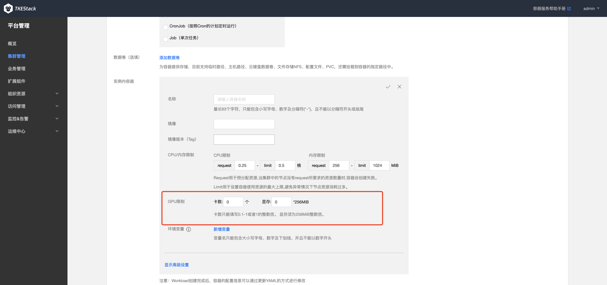
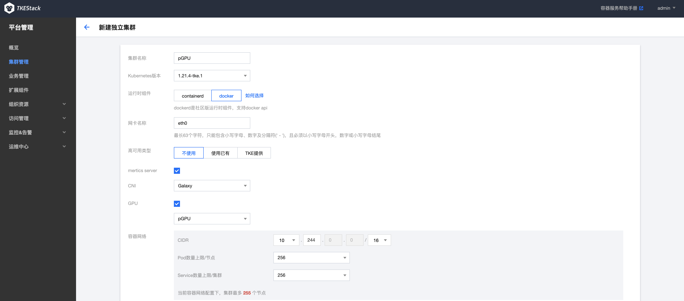
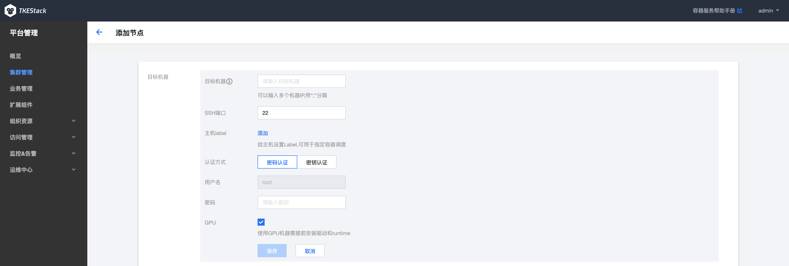

# 安装使用步骤

## 安装使用步骤

###  限制条件

* 用户在安装使用GPU时，要求集群内必须包含GPU机型节点
* 该组件基于 Kubernetes DevicePlugin 实现，只能运行在支持 DevicePlugin 的 kubernetes版本（Kubernetes 1.10 之上的版本）
* GPU-Manager 将每张 GPU 卡视为一个有100个单位的资源：当前仅支持 0-1 的小数张卡，如 20、35、50；以及正整数张卡，如200、500等；不支持类似150、250的资源请求；显存资源是以 256MiB 为最小的一个单位的分配显存

### TKEStack 支持的 GPU 类型
TKEStack目前支持两种GPU类型：
* vGPU：虚拟GPU类型(Virtual GPU)，当选择安装此类型的GPU时，平台会自动安装组件[GPUManager](https://github.com/tkestack/gpu-manager)，对应在集群中部署的kubernetes资源对象如下：

| kubernetes 对象名称   | 类型       | 建议预留资源           | 所属 Namespaces |
| --------------------- | ---------- | ---------------------- | --------------- |
| gpu-manager-daemonset | DaemonSet  | 每节点1核 CPU, 1Gi内存 | kube-system     |
| gpu-quota-admission   | Deployment | 1核 CPU, 1Gi内存       | kube-system     |
* pGPU: 物理GPU类型(Physical GPU)，当选择安装此类型的GPU时，平台会自动安装组件[Nvidia-k8s-device-plugin](https://github.com/NVIDIA/k8s-device-plugin)，对应的在集群中部署的kubernetes资源对象如下：

| kubernetes 对象名称   | 类型       | 建议预留资源           | 所属 Namespaces |
| --------------------- | ---------- | ---------------------- | --------------- |
| nvidia-device-plugin-daemonset | DaemonSet  | 每节点1核 CPU, 1Gi内存 | kube-system     |

### 安装步骤
#### 安装使用 vGPU 

用户在新建独立集群时，勾选GPU选项，在下拉选项中选择 vGPU，如下图所示：


目标机器部分，勾选GPU选项，平台会自动为节点安装GPU驱动，如下图所示：


等待新建独立集群处于running状态后，可以通过登陆到集群节点通过`kubectl`查看在集群`kube-system`命名空间中部署了`gpu-manager`和`gpu-quota-admission`两个pod：
```
# kubectl get pods -n kube-system | grep gpu
gpu-manager-daemonset-2vvbm              1/1     Running   0          2m13s
gpu-quota-admission-76cfff49b6-vdh42     1/1     Running   0          3m2s
```
#### 创建使用 vGPU 的工作负载

TKEStack创建使用GPU的工作负载支持两种方式：第一种是通过TKEStack前端页面创建，第二种是通过后台命令行的方式创建。

1、 通过前端控制台创建

在安装了 GPU-Manager 的集群中，创建工作负载时可以设置GPU限制，如下图所示：

> 注意：
>
> 1. 卡数只能填写 0.1 到 1 之间的两位小数或者是所有自然数，例如：0、0.3、0.56、0.7、0.9、1、6、34，不支持 1.5、2.7、3.54
> 2. 显存只能填写自然数 n，负载使用的显存为 n*256MiB



2、 通过后台命令行创建

使用 YAML 创建使用 GPU 的工作负载，需要在 YAML 文件中为容器设置 GPU 的使用资源。

* CPU 资源需要在 resource 上填写`tencent.com/vcuda-core` 
* 显存资源需要在 resource 上填写`tencent.com/vcuda-memory`

如下所示：创建一个使用 0.3 张卡、5GiB 显存的nginx应用（5GiB = 20*256MB）
```
apiVersion: v1
kind: Pod
metadata:
  name: nginx
spec:
  containers:
  - name: nginx
    image: nginx
    imagePullPolicy: IfNotPresent
    resources:
      limits:
        tencent.com/vcuda-core: 30
        tencent.com/vcuda-memory: 20
      requests:
        tencent.com/vcuda-core: 30
        tencent.com/vcuda-memory: 20
```
```
# kubectl create -f nginx.yaml
pod/nginx created
```

> 注意：
>
> - 如果pod在创建过程中出现CrashLoopBackOff 的状态，且error log如下所示：
> ```
> failed to create containerd task: OCI runtime create failed: container_linux.go:380: starting container process caused: process_linux.go:545: container init caused: Running hook #0:: error running hook: exit status 1, stdout: , stderr: nvidia-container-cli: mount error: open failed: /sys/fs/cgroup/devices/system.slice/containerd.service/kubepods-besteffort-podfd3b355a_665c_4c95_8e7f_61fd2111689f.slice/devices.allow: no such file or directory: unknown
> ```
> 需要在GPU主机上手动安装libnvidia-container-tools这个组件，首先需要添加repo源：添加repo源， 添加repo源后执行如下命令：
> ```
> # yum install libnvidia-container-tools
> ```
> - 如果pod在创建过程中出现如下error log：
> ```
> failed to generate spec: lstat /dev/nvidia-uvm: no such file or directory
> ```
> 需要在pod所在的主机上手动mount这个设备文件：
> ```
> # nvidia-modprobe -u -c=0
> ```
查看创建的应用状态：
```
# kubectl get pods
NAME    READY   STATUS    RESTARTS   AGE
nginx   1/1     Running   0          3s
```
查看GPU监控数据（需要提前安装socat）：
```
# yum install socat
```
```
# kubectl port-forward svc/gpu-manager-metric -n kube-system 5678:5678
```
```
# curl http://127.0.0.1:5678/metric
```
结果如下
```
Handling connection for 5678
# HELP container_gpu_memory_total gpu memory usage in MiB
# TYPE container_gpu_memory_total gauge
container_gpu_memory_total{container_name="nginx",gpu_memory="gpu0",namespace="default",node="10.0.0.127",pod_name="nginx"} 0
container_gpu_memory_total{container_name="nginx",gpu_memory="total",namespace="default",node="10.0.0.127",pod_name="nginx"} 0
# HELP container_gpu_utilization gpu utilization
# TYPE container_gpu_utilization gauge
container_gpu_utilization{container_name="nginx",gpu="gpu0",namespace="default",node="10.0.0.127",pod_name="nginx"} 0
container_gpu_utilization{container_name="nginx",gpu="total",namespace="default",node="10.0.0.127",pod_name="nginx"} 0
# HELP container_request_gpu_memory request of gpu memory in MiB
# TYPE container_request_gpu_memory gauge
container_request_gpu_memory{container_name="nginx",namespace="default",node="10.0.0.127",pod_name="nginx",req_of_gpu_memory="total"} 5120
# HELP container_request_gpu_utilization request of gpu utilization
# TYPE container_request_gpu_utilization gauge
container_request_gpu_utilization{container_name="nginx",namespace="default",node="10.0.0.127",pod_name="nginx",req_of_gpu="total"} 0.30000001192092896
```

#### 安装使用 pGPU 

用户在新建独立集群时，勾选GPU选项，在下拉选项中选择pGPU，如下图所示：



目标机器部分，勾选GPU选项，平台会自动为节点安装GPU驱动，如下图所示：


等待新建独立集群处于running状态后，可以通过登陆到集群节点通过`kubectl`查看到，在集群`kube-system`命名空间中部署了`nvidia-device-plugin`pod：
```
# kubectl get pods -n kube-system | grep nvidia
nvidia-device-plugin-daemonset-frdh2     1/1     Running   0          64s
```
通过查看节点信息可以看到GPU资源和使用情况：
```
# kubectl describe nodes <nodeIP>
```
显示信息如下：
```
Capacity:
  cpu:                8
  ephemeral-storage:  154685884Ki
  hugepages-1Gi:      0
  hugepages-2Mi:      0
  memory:             32779608Ki
  nvidia.com/gpu:     1
  pods:               256
Allocatable:
  cpu:                7800m
  ephemeral-storage:  142558510459
  hugepages-1Gi:      0
  hugepages-2Mi:      0
  memory:             31653208Ki
  nvidia.com/gpu:     1
  pods:               256
```
#### 创建使用vGPU的工作负载

- 通过控制台创建方式参考vGPU的创建步骤

- 通过命令行创建

通过如下YAML创建使用1个GPU的工作负载：

```
apiVersion: v1
kind: Pod
metadata:
  name: gpu-operator-test
spec:
  restartPolicy: OnFailure
  containers:
    - name: cuda-vector-add
      image: "tkestack/cuda-vector-add:v0.1"
      resources:
        limits:
          nvidia.com/gpu: 1
```
```
# kubectl create -f pod.yaml
pod/gpu-operator-test created
```
查看pod的状态和log：
```
# kubectl get pods
NAME                READY   STATUS      RESTARTS   AGE
gpu-operator-test   0/1     Completed   0          4m51s
```
```
# kubectl logs gpu-operator-test
[Vector addition of 50000 elements]
Copy input data from the host memory to the CUDA device
CUDA kernel launch with 196 blocks of 256 threads
Copy output data from the CUDA device to the host memory
Test PASSED
Done
```
通过再次查看节点信息可以看到GPU已经被分配使用：
```
kubectl describe nodes <nodeIP>
```
```
Allocated resources:
  (Total limits may be over 100 percent, i.e., overcommitted.)
  Resource           Requests     Limits
  --------           --------     ------
  cpu                1137m (14%)  282m (3%)
  memory             644Mi (2%)   1000Mi (3%)
  ephemeral-storage  0 (0%)       0 (0%)
  hugepages-1Gi      0 (0%)       0 (0%)
  hugepages-2Mi      0 (0%)       0 (0%)
  nvidia.com/gpu     1            1
```

#### 添加节点使用GPU
在添加节点上使用GPU资源，需要在创建添加节点时勾选GPU选项，如下图所示：



